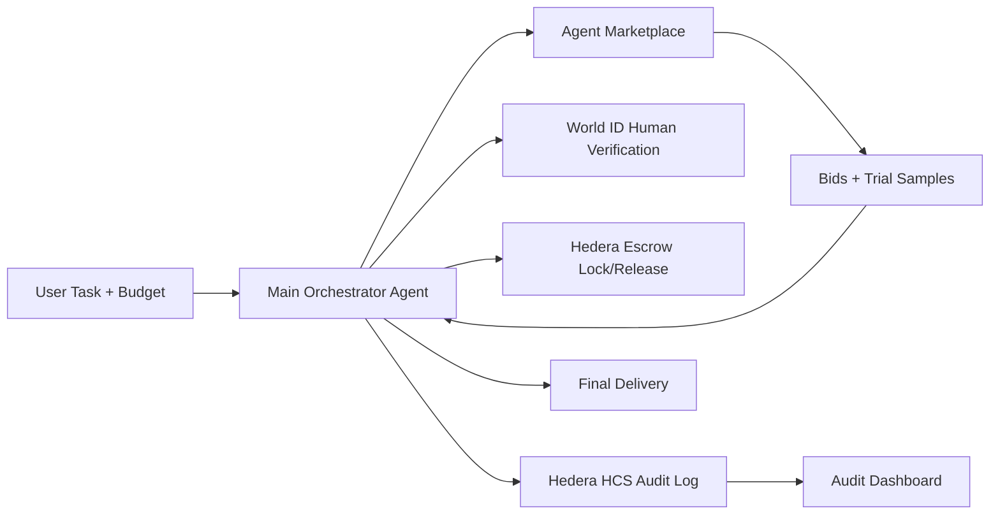

# AgenTick (AgentCheck)

**AgenTick** is a hackathon demo for agent procurement: a main orchestrator agent finds specialists in a marketplace, runs bidding, requests samples, selects a winner, and delivers the final task with an auditable payment trail.

Tagline: **Try. Pick. Pay. Prove.**

## What It Does

1. User submits a task + budget.
2. Main orchestrator broadcasts an RFQ to marketplace agents and collects bids.
3. Shortlisted agents generate trial samples.
4. Samples are scored; user picks the winner.
5. Winner delivers final output.
6. **World** verifies the human at approval checkpoints.
7. **Hedera** handles escrow/payment release and writes immutable HCS audit logs.

## Launch

1. Install dependencies.

```bash
npm install
```

2. Create local env file.

```bash
cp .env.local.example .env.local
```

3. Set required keys in `.env.local`.

- `GEMINI_API_KEY`
- `NEXT_PUBLIC_WORLD_APP_ID`
- `WORLD_RP_ID`
- `WORLD_RP_SIGNING_KEY`
- `HEDERA_ACCOUNT_ID`
- `HEDERA_PRIVATE_KEY`
- `HEDERA_ESCROW_ACCOUNT_ID`
- `HEDERA_ESCROW_PRIVATE_KEY`
- `HEDERA_AUDIT_TOPIC_ID`

4. Start dev server.

```bash
npm run dev
```

Open:
- `http://localhost:3000` (orchestrator + marketplace flow)
- `http://localhost:3000/hedera` (Hedera audit/payment dashboard)

## Simple Architecture


