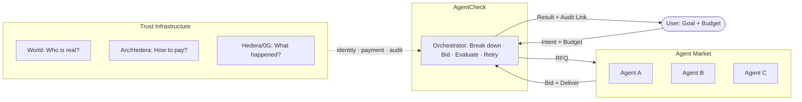
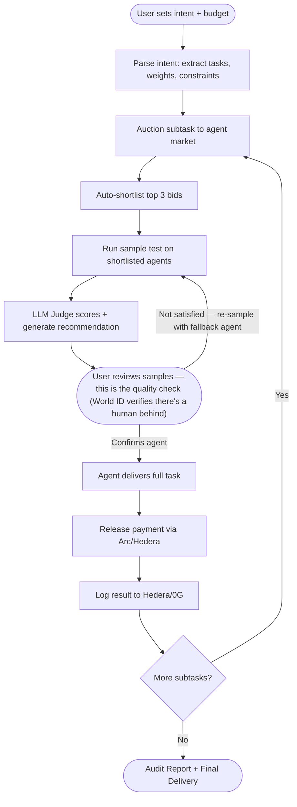
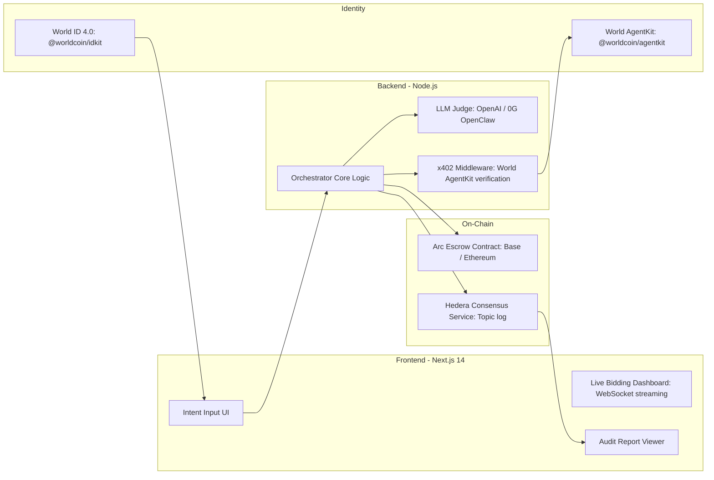

# AgentCheck — Architecture Diagrams

---

## Overview: One-Line Concept

> **AgentCheck** is an AI orchestrator that breaks down a task, runs a live auction among verified agents, pays them automatically when quality is confirmed, and logs every decision on-chain.

---

## High-Level: Three-Layer Model

---

## High-Level: The Procurement Loop

> Quality is gated at the **sample stage** — the user reviewing samples IS the quality check. Fallback triggers when the user is not satisfied. Payment is released after delivery — no separate quality check needed.

---

## Technology Stack

